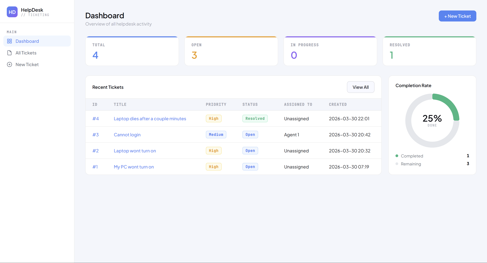
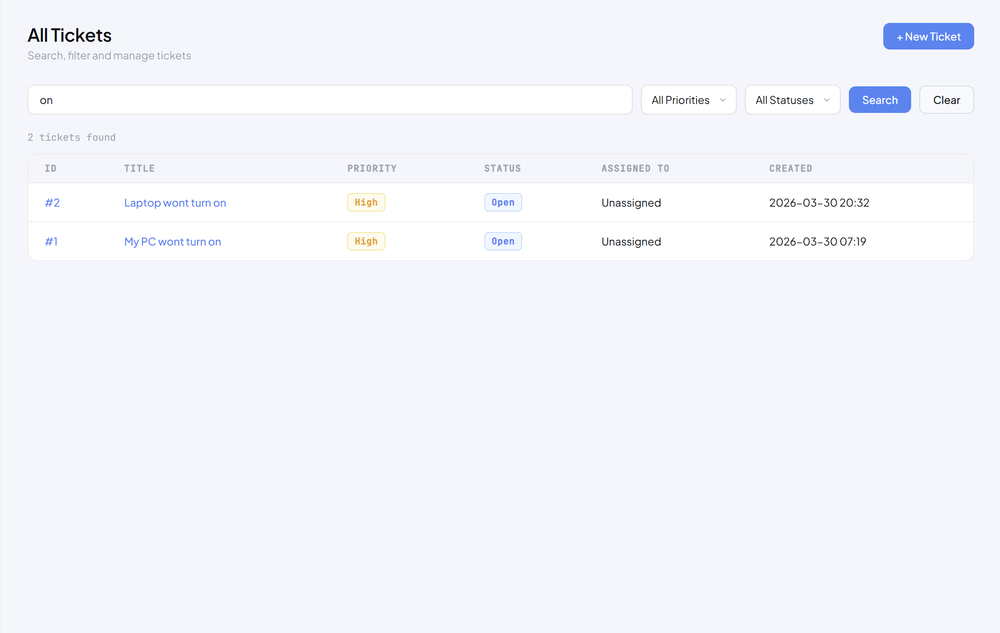
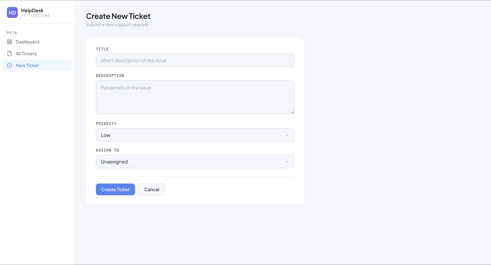

# Helpdesk Ticketing Simulator

A full stack Python web application that simulates a real helpdesk ticketing system. Built with Flask and SQLite, it mirrors the core workflows found in enterprise tools like ServiceNow, Jira, and Zendesk.

Built as part of my IT and cybersecurity learning journey as a first-year CIS student at Cal Poly Pomona, with the goal of understanding how helpdesk tools work under the hood before using them professionally.

---

## Screenshots

**Dashboard**


**All Tickets with Search**


**Create New Ticket**


---

## Features

- Create tickets with title, description, priority level and agent assignment
- View all tickets with real-time search and filter by priority and status
- View individual ticket details with full comment history
- Add notes and comments to tickets
- Edit ticket status, priority, and assignment
- Dashboard with live stats — total, open, in progress, and resolved counts
- Donut chart showing completion rate that updates dynamically
- Color coded priority and status badges
- Tickets are never deleted — status is updated to Resolved or Closed to preserve audit history
- Clean white UI with colorful widgets inspired by real ITSM tools

---

## Technologies Used

- **Python 3** — Core programming language
- **Flask** — Web framework for routing and request handling
- **SQLAlchemy** — Python ORM for database interaction without writing raw SQL
- **SQLite** — Lightweight database for storing tickets and comments
- **Jinja2** — Templating engine for passing Python data into HTML
- **Chart.js** — JavaScript library for the donut completion chart
- **HTML** — Page structure and forms
- **CSS** — Custom colorful light theme UI with Google Fonts

---

## How It Works

1. User creates a ticket by filling out a form with a title, description, priority and agent assignment
2. Flask receives the form data via POST request and saves it to the SQLite database using SQLAlchemy
3. The dashboard queries the database for ticket counts and calculates the completion percentage
4. Users can search tickets using SQL LIKE queries and filter by priority or status via GET parameters
5. Clicking a ticket loads its full details and all associated comments from the database
6. Editing a ticket updates the record in the database — tickets are never deleted to preserve history
7. The donut chart receives the completion data from Flask via Jinja2 and renders dynamically using Chart.js

**Database Structure:**
```
tickets
├── id            — Auto generated unique ticket number
├── title         — Short issue description
├── description   — Full issue details
├── priority      — Low / Medium / High / Critical
├── status        — Open / In Progress / Resolved / Closed
├── assigned_to   — Agent name or Unassigned
├── created_at    — Auto timestamp on creation
└── updated_at    — Auto timestamp on every update

comments
├── id            — Auto generated unique ID
├── ticket_id     — Foreign key linking to tickets table
├── note          — Comment text
└── created_at    — Auto timestamp
```

---

## How to Run

1. Make sure Python 3 is installed on your machine
2. Install dependencies:
```
   pip install flask flask-sqlalchemy
```
3. Clone this repository:
```
   git clone https://github.com/z76hxtzzms-cmyk/helpdesk-ticketing-simulator.git
```
4. Navigate into the project folder:
```
   cd helpdesk-ticketing-simulator
```
5. Run the Flask app:
```
   python app.py
```
6. Open your browser and go to:
```
   http://127.0.0.1:5000
```

---

## Project Structure
```
helpdesk-ticketing-simulator/
├── app.py                  — Flask web server and all route handling
├── database.py             — SQLAlchemy database models (Ticket, Comment)
├── templates/
│   ├── dashboard.html      — Main dashboard with stats and donut chart
│   ├── tickets.html        — All tickets with search and filter
│   ├── new_ticket.html     — Create ticket form
│   ├── view_ticket.html    — Individual ticket detail and comments
│   └── edit_ticket.html    — Edit ticket status, priority, assignment
├── static/
│   └── style.css           — Colorful light theme UI
├── screenshots/
├── instance/               — SQLite database lives here (gitignored)
└── README.md
```

---

## What I Learned

- How to design and implement a **relational database** using SQLAlchemy — defining tables as Python classes and relationships between them using foreign keys
- How **CRUD operations** work in a real application — Create, Read, Update, and intentionally never Delete to preserve audit trails
- How to write **database queries** in Python using SQLAlchemy including filtering, ordering, counting, and limiting results
- Why tickets should never be deleted in real helpdesk systems — status updates preserve history for auditing and compliance
- How **Flask routes** handle different HTTP methods and URL variables like `<int:ticket_id>`
- How **Jinja2 templating** passes Python data into HTML and supports logic like loops and conditionals directly in templates
- The difference between **GET and POST** requests and when each is appropriate
- What **foreign keys and table relationships** are and how they link tickets to their comments
- How real ITSM tools like **ServiceNow and Jira** work under the hood at a conceptual level

---

## Future Improvements

- [ ] Add user authentication so agents can log in and see their assigned tickets
- [ ] Add email notifications when a ticket is assigned or updated
- [ ] Implement ticket categories and tags for better organization
- [ ] Add ticket due dates and overdue alerts

---

## AI Assistance

I built the common logic and structure of the program and designed the overall architecture myself. Most of the database.py logic was implemented by me with some basic understanding of SQLAlchemy and quick research through Google and YouTube. Some of the app.py logic was implemented by me, but the more advanced features such as search, configurations, and edit ticket routes were built with the help of Claude AI. A large portion of the HTML and CSS was done with AI assistance to create a visually appealing UI. I made sure to include detailed comments throughout all logic-based code to ensure I actually understood what was happening, connecting what I learned with what AI was doing. These comments also serve as a personal reference so I can rely on this project when building future applications.